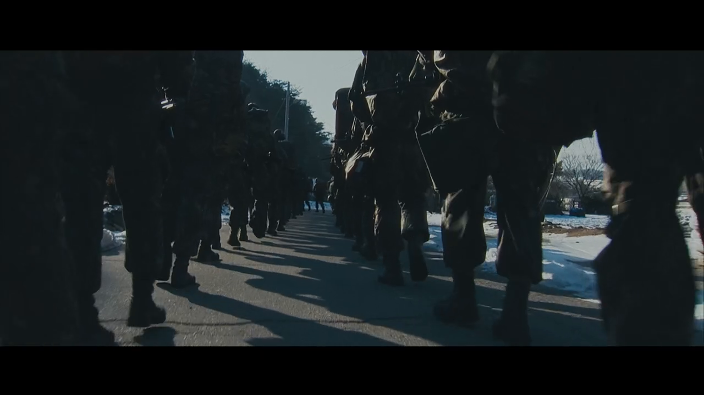
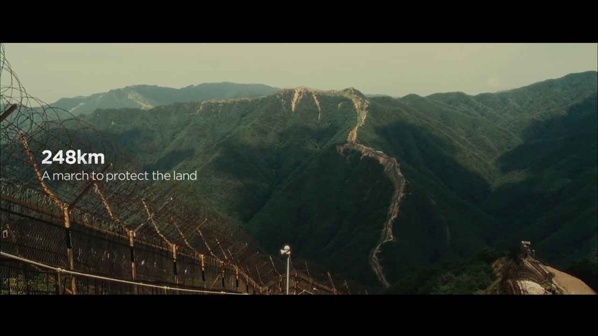

## 4. 실제 작업 예시 — 우리가 한 것들

챗봇으로 AI를 쓸 때는 보통 질문을 던지고 답을 받는 방식이 중심입니다. 로컬 AI는 조금 다릅니다. **권한을 준 폴더와 도구 안에서 자료를 찾고, 분류하고, 만들고, 정리하는 여러 단계를 이어서 처리할 수 있습니다.**

아래 예시는 “이런 일을 하고 싶었다 → 로컬 AI에게 이렇게 맡겼다 → 이런 결과가 나왔다”는 흐름으로 보면 됩니다.

### 4.1 레퍼런스 영상 자동 수집·필터링

광고 영상 사이트인 TVCF에서 해외 광고를 훑어보며, 영화처럼 조명과 구도가 살아 있는 ‘시네마틱한’ 레퍼런스만 모으고 싶었습니다. 문제는 후보가 수백 개였다는 점입니다. 사람이 하나씩 보기에는 시간이 너무 많이 들었고, 영상 주소도 페이지 안쪽에 숨어 있어 일반적인 저장 방식으로는 잘 잡히지 않았습니다.

그래서 권한을 준 범위 안에서 로컬 AI에게 브라우저를 열고 페이지를 살펴보게 했습니다. 이후 실제 영상 주소를 찾아 영상을 받도록 맡겼습니다. 받은 영상은 앞부분을 1초 간격의 이미지로 뽑고, 그 이미지들을 기준으로 AI가 “시네마틱한가”를 1차, 2차로 나누어 걸렀습니다.

*다운로드한 영상의 앞부분을 일정 간격으로 캡처해, 이 장면들을 보고 시네마틱한지 판단했습니다.*

*실제로 수집·통과된 레퍼런스 영상 예시입니다.*

이미 확인한 영상은 목록에 기록해 두었습니다. 덕분에 같은 영상을 다시 받거나 다시 판단하지 않게 할 수 있었습니다. **결과적으로 수백 개 후보가 수십 개의 통과작으로 줄었고, 마지막 선택은 사람이 갤러리에서 직접 했습니다.**

이 작업에서는 브라우저 조작, 영상 추출, 다운로드, 후보 분류, 갤러리 확인이 함께 이어졌습니다. 사용된 도구는 다음과 같습니다:

- Playwright(브라우저 자동 조작 도구)
- ffmpeg(영상 변환·추출 도구)
- yt-dlp(영상 다운로드 보조 도구)
- 서브에이전트(작은 전문 담당 AI)
- HTML 갤러리

### 4.2 영상 제작 파이프라인: 이미지→영상→음성→조립

광고나 드라마 스타일 영상을 한 편 만든다고 해도, 한 번에 완성본이 나오는 것은 아닙니다. 먼저 시나리오와 컷 구성(장면 단위의 설계)을 잡고, 그다음 제품·캐릭터·배경에 맞는 키 이미지를 만듭니다. 이 이미지를 바탕으로 스토리보드를 잡고, 컷별로 짧은 영상을 생성한 뒤, 음성(TTS, 글을 음성으로 바꾸는 기술)과 배경음악을 붙였습니다.

*키 이미지를 바탕으로 컷별로 만든 짧은 영상 예시입니다. 이런 조각들을 모아 한 편으로 조립합니다.*

이 흐름에서 로컬 AI는 단계별로 알맞은 생성 모델을 부르고, 앞 단계 결과를 다음 단계 입력으로 넘기는 역할을 맡았습니다. **핵심은 AI가 직원처럼 일을 이어서 하되, 결재가 필요한 지점에서는 사람이 승인한다는 감각입니다.**

특히 이미지나 영상 생성은 비용이 발생할 수 있습니다. 그래서 모델, 해상도, 화면 비율, 오디오 여부처럼 돈과 품질에 영향을 주는 선택은 실행 전에 사람이 확인했습니다. 마지막에는 음성, 배경음악, 영상 조각을 모아 하나의 결과물로 조립했습니다.

이 파이프라인에는 생성 모델 호출부터 음성, 음악, 영상 조립까지 여러 도구가 연결됐습니다:

- 이미지·영상 생성 모델: GPT-Image-2, Seedance 등(2026-05 기준, 공식 문서 확인 필요)
- Replicate/CometAPI(생성 모델 호출 서비스)
- ElevenLabs(TTS)
- Suno(BGM 생성)
- ffmpeg(영상 조립)

### 4.3 결과물 셀렉용 HTML 갤러리 만들기

이미지 생성 단계에서는 좋은 컷이 하나만 나오는 것이 아닙니다. 비슷하지만 조금씩 다른 후보가 수십 장씩 생깁니다. 파일 이름만 보고는 어떤 이미지가 좋은지 알기 어렵고, 폴더를 하나씩 열어 보는 방식은 금방 지칩니다.

그래서 로컬 AI에게 권한을 준 작업 폴더 안의 이미지들을 한 화면에 격자로 보여주는 HTML 갤러리를 만들게 했습니다. HTML 갤러리는 브라우저에서 보는 간단한 선택 페이지입니다. **인터넷에 공개하는 배포물이 아니라, 내 컴퓨터에서만 브라우저로 열어 보는 내부 선택판에 가깝습니다.**

마음에 드는 이미지를 클릭하면 선택한 것만 따로 모아지도록 했습니다. 이후 영상 제작에 쓸 베스트 컷만 빠르게 남길 수 있었습니다. 사람은 고르는 일에 집중하고, 정리와 복사는 로컬 AI가 맡은 셈입니다.

이 작업에는 가볍게 화면을 만들고 로컬에서 확인하는 도구들이 쓰였습니다:

- HTML
- 로컬 HTTP 서버(내 컴퓨터에서 임시로 페이지를 보여주는 장치)
- 브라우저

### 4.4 인스타그램 카드뉴스·자동 업로드

AI 관련 소식을 모아 인스타그램 카드뉴스로 만들고, 반복적으로 계정에 올리는 흐름도 자동화할 수 있었습니다. 먼저 자료를 수집하고, 그 내용을 여러 장의 카드 이미지로 정리하는 제작 과정을 로컬 AI에게 맡겼습니다.

게시 단계에서는 Meta Graph API(인스타그램 같은 Meta 서비스와 연결하는 공식 API)를 통해 계정에 올리는 흐름으로 이어졌습니다. 댓글이 달리면 웹훅(특정 사건이 생겼을 때 자동으로 알려 주는 연결 방식)을 통해 자동 DM 같은 후속 동작으로 이어지게 했습니다.

**이 작업의 핵심은 수집, 제작, 게시처럼 반복되는 일을 하나의 흐름으로 묶는 데 있습니다.** 다만 API 키와 계정 정보 같은 비밀값은 외부에 노출되지 않도록 별도로 안전하게 관리해야 합니다.

이 흐름에는 자료 수집, 카드 제작, 게시 연동, 후속 자동화가 함께 들어갔습니다:

- 자료 수집 스크립트(정해진 자료를 모으는 자동 작업)
- HTML/이미지 카드 제작
- Meta Graph API
- 웹훅

### 공통점은 반복을 맡기는 방식입니다

이 모든 작업의 공통점은 사람이 큰 방향과 최종 승인을 맡고, 반복·대량 작업은 로컬 AI가 처리했다는 점입니다. 로컬 AI는 혼자 모든 판단을 끝내는 마법 도구라기보다, 권한을 받은 범위 안에서 자료를 모으고 정리하고 실행까지 이어 주는 작업 파트너에 가깝습니다.

영상 크리에이터에게 중요한 것은 도구 이름을 많이 외우는 것이 아닙니다. **“내 작업 중 어떤 반복을 맡길 수 있을까”를 떠올리는 감각이 더 중요합니다.**